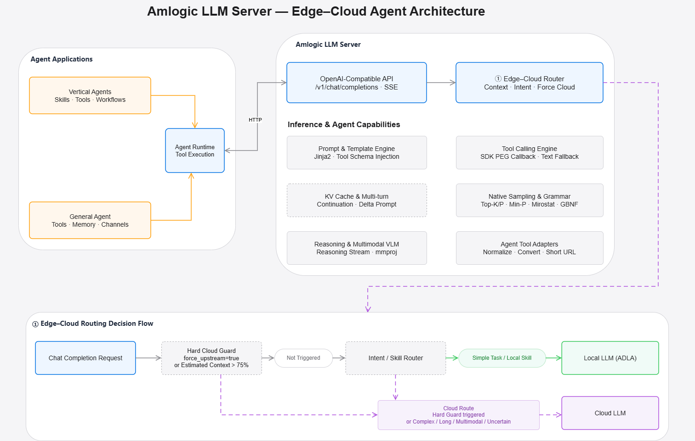

# Amlogic LLM Server

An OpenAI-compatible LLM serving layer for Amlogic devices. It allows existing
Agent applications and OpenAI SDK clients to use an on-device NPU model while
retaining an optional cloud fallback for requests that exceed local model
capabilities or context limits.

The server is designed for **local-first Agent applications**:

- OpenAI-compatible `/v1/chat/completions` API and SSE streaming
- On-device LLM/VLM inference through Amlogic LLMSDK and ADLA runtime
- Automatic edge-cloud routing based on context pressure and task intent
- Tool/function calling with schema injection and structured result handling
- KV-cache reuse for efficient multi-turn conversations
- Jinja2 chat templates, native sampling, grammar constraints, and reasoning output
- Model bootstrap, health checks, evaluation, and Agent benchmarks

> The cloud route is optional. When no upstream API is configured, requests are
> handled locally and local model limits are returned as normal API errors.

## Architecture

<p align="center">
  
</p>

The architecture is divided into three functional layers plus a routing
decision flow:

1. **Agent Applications** provide user-facing workflows, memory, channels, and tools.
2. **Amlogic LLM Server** exposes the OpenAI-compatible API and contains the
   prompt, tool-calling, routing, sampling, and multi-turn inference logic.
3. **Edge-Cloud Execution** runs simple and privacy-sensitive workloads on the
   Amlogic NPU and optionally forwards suitable requests to a cloud LLM.
4. **Edge-Cloud Routing Decision Flow** makes the execution decision before
   generation starts.

### Agent application layer

The server does not require a specific Agent framework. Any application that
can call an OpenAI-compatible API can use it as its model endpoint.

| Component | Responsibility | Typical examples |
|-----------|----------------|------------------|
| **Vertical Agents** | Package domain-specific skills, tools, prompts, and deterministic workflows for a defined business scenario | Meeting summary, shopping assistant, AI NAS/photo search, customer service, document assistant |
| **General Agent** | Provides open-ended conversation, generic tool use, memory, and multiple user channels | Personal assistant, chat application, voice assistant, multi-tool automation |
| **Agent Runtime** | Owns the Agent loop outside the LLM server: sends messages, executes requested tools, returns tool results, maintains application memory, and renders streaming output | Web/mobile application, device service, desktop client, embedded Agent framework |

`Vertical Agents` and `General Agent` are parallel application types. Both use
the same `Agent Runtime`, which communicates with the server over HTTP. The
server selects and calls tools, but actual tool execution remains in the Agent
Runtime unless the application explicitly implements a server-side tool.

### OpenAI-compatible API layer

The API layer keeps the model service compatible with common Agent SDKs and
existing OpenAI clients.

| Capability | Description |
|------------|-------------|
| `POST /v1/chat/completions` | Text, multi-turn, streaming, tool-calling, reasoning, and multimodal chat requests |
| `POST /v1/audio/transcriptions` | Speech-to-text with the on-device ASR models (Whisper / SenseVoice), multipart upload |
| `GET /v1/models` | Lists enabled local model configurations and their metadata |
| `GET /healthz` | Lightweight service health check for deployment and supervision |
| SSE streaming | Streams generated content incrementally instead of waiting for the full response |
| API key | Optional bearer-token authentication configured on the server |
| CORS | Allows approved browser-based Agent clients to access the API |

#### ASR interfaces

`POST /v1/audio/transcriptions` follows the OpenAI audio API shape (`multipart/form-data`):

| Field | Required | Description |
|-------|----------|-------------|
| `file` | Yes | Audio upload, WAV PCM; 16 kHz mono is expected (sample rate `0`/absent means 16 kHz) |
| `model` | Yes | An ASR model **id** (`whisper-…` / `sensevoice-…`), see [Model ids](#model-ids) |
| `language` | No | ISO-639-1 (`en`, `zh`, `ja`, `ko`, `yue`, …) or `auto` (default from `model.json`) |
| `task` | No | `transcribe` (default) or `translate` (Whisper only, may fail if unsupported) |
| `response_format` | No | `json` (default, `{"text": "..."}`) or `text` (plain-text body) |

```bash
# JSON response
curl -s http://localhost:8000/v1/audio/transcriptions \
  -F file="@en_16k.wav" -F model="whisper-large-v3-turbo" -F language="auto"

# plain-text response
curl -s http://localhost:8000/v1/audio/transcriptions \
  -F file="@en_16k.wav" -F model="sensevoice-small" -F response_format="text"
```

Behaviour and error codes:

- The response currently carries `text` only; the detected language is not returned.
- `language=auto` runs the Whisper decoder language-detect step; SenseVoice maps it to its own LID
  (`auto` / `zh` / `en` / `ja` / `ko` / `yue` / `nospeech`).
- Wrong endpoint for a model: an ASR id on `/v1/chat/completions` returns
  `400 {"detail": "Model <id> is ASR; use POST /v1/audio/transcriptions"}`, and a chat id on
  `/v1/audio/transcriptions` returns `400 {"detail": "Model <id> is not an ASR model"}`.
- `404` for an unknown model; `429` when that ASR model is already transcribing
  (see [One session per model](#one-session-per-model-modelsreject_when_busy)); `500` when the ASR
  engine fails to initialise or the upload cannot be decoded.
- There is no separate `/v1/audio/translations` route: Whisper translation is reached with
  `task=translate` on the same endpoint.
- A transcription cannot be cancelled on the device, so a client that disconnects still occupies
  that model until the run finishes.

File layout, `model.json` keys and language-detection details are in
[On-device ASR](#on-device-asr-post-v1audiotranscriptions) below.

### Inference and Agent capabilities

#### Prompt and template engine

- Converts OpenAI `messages` into the model-specific prompt format.
- Supports inline Jinja2 templates or a template loaded from
  `tokenizer_config.json`.
- Injects tool schemas into tool-aware templates.
- Supports system prompts, template keyword arguments, prompt prefix/postfix,
  thinking-mode switches, and special model tokens.

#### Tool-calling engine

- Passes OpenAI-compatible function schemas to LLMSDK.
- Uses the SDK PEG parser and `on_tool_call` callback as the primary structured
  tool-call path.
- Falls back to parsing tool-call markup from generated text when no structured
  callback is produced.
- Returns `tool_calls` in an OpenAI-compatible assistant message so the Agent
  Runtime can execute the function and submit the result in the next turn.

#### KV cache and multi-turn continuation

- Detects when a request continues the previous conversation.
- Reuses the existing local model state instead of rebuilding the complete
  context on every turn.
- Sends only the newly appended messages as a delta prompt when the history is
  compatible with the cached state.
- Falls back to a full prompt when the conversation is replaced, reordered, or
  otherwise cannot safely continue from the cached state.

#### Native sampling and grammar

The server exposes LLMSDK sampling controls through a unified
`sampler_params` dictionary. Supported controls include temperature, Top-K,
Top-P, Min-P, typical sampling, repetition/presence/frequency penalties,
Mirostat, deterministic seed selection, sampler ordering, and GBNF grammar
constraints.

Grammar-constrained generation is particularly useful for tool calls and
machine-readable Agent output because it can restrict model output to a known
structure.

#### Reasoning and multimodal VLM

- Supports models that expose reasoning content separately from the final answer.
- Can stream reasoning and normal response content through the API response path.
- Supports an `mmproj` projector model and image placeholders for VLM requests.
- Multimodal capability depends on the selected model, projector, and local
  runtime support.

A VLM model directory needs the weights **and** the `mmproj` projector next to
each other; `bootstrap` wires both into the generated `model.json` (`mmproj`
plus `metadata.multimodal = true`). Images are sent as `image_url` content
parts, exactly like the OpenAI API:

```bash
curl -s http://localhost:8000/v1/chat/completions \
  -H "Content-Type: application/json" \
  -d '{
    "model": "qwen3-vl-2b-instruct",
    "messages": [{"role": "user", "content": [
      {"type": "text", "text": "What shapes and colors are in this image?"},
      {"type": "image_url", "image_url": {"url": "data:image/png;base64,iVBORw0KGgo..."}}
    ]}],
    "max_tokens": 1024
  }'
```

- Image URLs may be `data:` (base64), `http(s):` or `file:` URIs; the runtime
  decodes them to RGB and hands the SDK a tightly packed RGB888 buffer
  (`H×W×3` uint8, the layout `llmsdk.h` requires).
- The current runtime accepts **one image per request**.
- A VLM whose `model.json` has no `mmproj` answers text-only requests and warns
  that image input is unavailable.

#### Agent tool adapters

Tool results frequently contain application-specific objects that are too
large or inconsistent for a small local model. Agent tool adapters provide a
normalization boundary between tools and the model:

- Normalize field names and tool-result envelopes.
- Convert structured results into compact model-readable text.
- Reduce unnecessarily long payloads and URLs before they enter the context.
- Keep tool-result formatting consistent across local and cloud execution.

These adapters are compatibility utilities, not a dependency on any specific
Agent product.

## Edge-cloud routing (Experimental)

The router follows a local-first policy. It first evaluates hard cloud guards,
then asks the configured intent/skill router whether the task is appropriate
for the local model.

### Routing decision order

| Priority | Decision | Result |
|----------|----------|--------|
| 1 | `force_upstream=true` | Route directly to the configured upstream API |
| 2 | Estimated prompt/context usage exceeds the configured local safety threshold (approximately 75% in the default policy) | Route to cloud before the local context window is exhausted |
| 3 | Intent/skill router identifies a simple task or a supported local skill | Execute with the local Amlogic model |
| 4 | Intent/skill router identifies a complex, long-context, unsupported multimodal, or uncertain request | Route to the cloud LLM |
| 5 | No upstream is configured | Keep the request local and surface local capability/context errors normally |

The context guard is evaluated before intent routing because an otherwise
simple task may still be unsafe to run locally when its conversation history,
tool schemas, or image tokens already consume most of the model context.

### Local route

The local route is preferred for:

- Short question answering and common device-control requests
- Tasks covered by a known local skill or deterministic workflow
- Privacy-sensitive content that should remain on the device
- Offline operation and latency-sensitive interactions
- Tool calls that can be selected reliably by the local model

Local inference is executed by LLMSDK on the Amlogic NPU. The Agent Runtime
continues to execute external tools and returns tool results through subsequent
chat-completion requests.

### Cloud route and upstream API

The **upstream API** is an OpenAI-compatible cloud endpoint configured under
`upstream`. It is not a second local runtime. When cloud routing is selected,
the server forwards the normalized chat request to this endpoint and relays the
response or SSE stream back to the original Agent client.

Typical cloud-route reasons include:

- The local context is close to its configured capacity.
- The request explicitly forces upstream execution.
- The task requires stronger reasoning or broader knowledge.
- The request requires a multimodal capability unavailable in the local model.
- The router cannot confidently match the request to a supported local skill.

### Skill injection

When `skill_injection` is enabled, the server can add the matched local skill
context to an upstream request. The injected context may contain task-specific
instructions, tool descriptions, output requirements, or workflow constraints.
This preserves the behavior of a vertical Agent even when generation moves to
the cloud.

Skill injection does **not** upload the local skill implementation or execute
device tools in the cloud. Tool execution still belongs to the Agent Runtime;
only the context required by the cloud model is added to the forwarded prompt.

### End-to-end request flow

1. An Agent Runtime sends an OpenAI-compatible chat-completion request.
2. The API layer validates authentication, model selection, messages, tools,
   streaming options, and multimodal inputs.
3. The hard cloud guard checks `force_upstream` and estimated context usage.
4. If no hard guard is triggered, the intent/skill router selects local or cloud execution.
5. For a local request, the prompt engine renders the model template and the
   server reuses KV cache when the request is a valid continuation.
6. LLMSDK runs generation on the Amlogic NPU using request-level sampling and
   grammar settings.
7. Tool calls are returned to the Agent Runtime. The runtime executes the tool
   and sends the result back as a new message.
8. For a cloud request, optional skill context is injected and the request is
   forwarded to the upstream OpenAI-compatible endpoint.
9. Local or cloud output is normalized and returned through the same response
   format, so the Agent application does not need separate execution paths.

## Installation

### Prerequisites

This project is using `uv` please use following command or follow the [official document](https://docs.astral.sh/uv/getting-started/installation/) to install uv

```bash
curl -LsSf https://astral.sh/uv/install.sh | sh
```

### Install the wheel

```bash
uv venv --python 3.11
uv pip install amlllm-openai-server -i <index url>
```

### Bootstrap

#### Use a bootstrap tool

_You need Internet connection to use bootstrap scripts to download the models or you can manually put files in folder_

1. List the available model

```bash
uv run -m amlllm_openai_server.bootstrap list
```

You will see the available models as following table (`Type` is the runtime
family — `LLM`, `VLM` or the ASR backend `whisper` / `sensevoice` — and `Files`
counts the side-cars shipped with the weights, e.g. `mmproj` or a tokenizer):

| \# | Name | Type | Thinking | Multimodal | Context | Tools | Files |
|----|------|------|----------|------------|---------|-------|-------|
| 0 | sensevoice-small | sensevoice | No | No | 8192 | No | 1 |
| 1 | whisper-large-v3-turbo | whisper | No | No | 8192 | No | 3 |
| 2 | Qwen3-0.6B | LLM | Yes | No | 8192 | Yes | 0 |
| 3 | Qwen3-4B-Instruct-2507 | LLM | No | No | 8192 | Yes | 0 |
| … | Qwen3-VL-2B-Instruct | VLM | No | Yes | 8192 | Yes | 1 |

`list` prints every model in the repository, in the same order as `metadata.jsonl`
(the table above is a sample of it).

2. Download the model

Replace the model name as your expectation. Here use `Qwen3-4B-Instruct-2507` for example.

```bash
uv run -m amlllm_openai_server.bootstrap download Qwen3-4B-Instruct-2507
uv run -m amlllm_openai_server.bootstrap download Qwen3-VL-2B-Instruct
uv run -m amlllm_openai_server.bootstrap download whisper-large-v3-turbo
uv run -m amlllm_openai_server.bootstrap download sensevoice-small
```

Each model goes into its own `models/<dir>/` directory (weights, side-cars and a
generated `model.json`), and `config/server.yaml` is created or updated with
that directory appended to `models.enabled`. Useful options: `-t/--target`
(working directory, default the current one) and `-f/--force` (re-download).
A download that does not complete exits non-zero and keeps the model out of
`models.enabled`.

#### Where the files come from

The model repository's `metadata.jsonl` is the only index, and the addresses it
contains are **repo-relative** (e.g. `LLM/A311Y3/Qwen3-0.6B-Q4AM_PB32.adla`), so
the download source is decided by `--baseurl` (or `$AMLLLM_MODEL_ZOO`) and never
by the index itself:

| `--baseurl` value | Source |
|---|---|
| omitted | ModelScope, default repo `Amlogic/amlnn-adla-models` |
| `modelscope:` / `ms:` / `owner/repo` | ModelScope (`owner/repo` picks another repo) |
| `hf:` / `huggingface:` | HuggingFace mirror `Amlogic-NN/amlnn-adla-models` |
| `hf:org/repo@revision` | another HuggingFace repo / revision |
| `https://…` | any plain-HTTP mirror of the repo layout |
| `/local/dir` | an offline directory (same layout on disk) |

```bash
# the same index, fetched from the HuggingFace mirror instead
uv run -m amlllm_openai_server.bootstrap --baseurl hf list
uv run -m amlllm_openai_server.bootstrap --baseurl hf download Qwen3-0.6B
```

#### Model ids

The `model` field of an API request is the `id` in `model.json`. For models
downloaded with the bootstrap tool that id is the **lowercase slug** of the
model name (only `a-z`, `0-9` and `-`), deduplicated with a `-2`, `-3` … suffix
when two models would otherwise collide:

| Model name | `model.json` `id` |
|---|---|
| `Qwen3-0.6B` | `qwen3-0-6b` |
| `Qwen3-4B-Instruct-2507` | `qwen3-4b-instruct-2507` |
| `Qwen3-VL-2B-Instruct` | `qwen3-vl-2b-instruct` |
| `whisper-large-v3-turbo` | `whisper-large-v3-turbo` |

`models.enabled` lists the **directory names**, while a request uses this `id`.

---

## Server Configuration

### `config/server.yaml`

```yaml
server:
  host: "0.0.0.0"
  port: 8000
  api_key: ""          # optional, set for authentication
  log_level: "info"
  title: "AMLLLM OneAPI Proxy"
  version: "0.2.0"

models:
  root_dir: "../models"
  reject_when_busy: true       # one session per model; false = queue instead of 429
  enabled:
    - default                    # model directories under root_dir
    - whisper-large-v3-turbo     # ASR, see On-device ASR below
    - sensevoice-small           # ASR

# Optional: upstream proxy to a cloud API
# upstream:
#   base_url: "https://api.openai.com"
#   api_key: "sk-..."
#   model: "gpt-4o"
#   force_upstream: false
#   skill_injection: false
```

#### Upstream configuration

| Parameter | Required | Description |
|-----------|----------|-------------|
| `base_url` | Yes | Base URL of the OpenAI-compatible cloud service |
| `api_key` | Depends on provider | Authentication credential used only for upstream requests |
| `model` | Yes | Cloud model identifier sent to the upstream provider |
| `force_upstream` | No | Bypasses local routing and sends all eligible requests upstream |
| `skill_injection` | No | Adds matched skill instructions and constraints to the upstream prompt |

Keep the upstream API key on the server. Agent clients should authenticate to
the Amlogic server and should not receive the upstream provider credential.

#### One session per model (`models.reject_when_busy`)

A model runs one session at a time. While a model is generating (or
transcribing), a new request for **that same model** is answered immediately
with `429` instead of queueing:

```json
{"detail": "Model qwen3-0-6b is busy (one session per model)"}
```

Different models stay independent, so e.g. `Qwen3-0.6B`, a VLM and an ASR model
can run at the same time. Set `models.reject_when_busy: false` to fall back to
the previous behaviour, where a second request waits for the running one.

Two consequences worth knowing:

- A client that disconnects mid-stream stops the run: the server interrupts the
  model (`~0.5s` on A311Y3), so the session is released quickly instead of
  keeping the model busy until the answer is complete.
- ASR cannot be interrupted on the device (the ASR SDK has no cancel entry
  point), so an abandoned transcription still runs to completion and holds the
  session, answering `429` to a retry until it finishes.

### `models/default/model.json`

Example for Qwen3 Seriers:

```json
{
  "id": "amlogic-default",
  "weights": "Qwen3-1.7B-Q4AM_PB32.adla",
  "model_type": "qwen",
  "sampling_mode": "top_p",
  "sampler_params": {"temp": 0.7, "top_p": 0.85, "top_k": 40, "penalty_repeat": 1.15},
  "system_prompt": "You are a helpful assistant.",
  "prompt_prefix": "",
  "prompt_postfix": "",
  "retain_history": true,
  "loglevel": "ERROR",
  "metadata": {
    "family": "default",
    "device": "amlogic"
  },
  "chat_format": "\n    ... (Qwen3 tool-aware Jinja2 template) ...\n"
}
```

> The example above uses legacy top-level sampling keys for brevity. The
> preferred form is a single `sampler_params` dict, e.g.
> `"sampler_params": {"temp": 0.7, "top_p": 0.85, "top_k": 40, "penalty_repeat": 1.15}`.

### Model Configuration Parameters

| Parameter | Type | Required | Default | Description |
|-----------|------|----------|---------|-------------|
| `id` | `string` | Yes | — | Unique model identifier, used as `model` in OpenAI API requests (bootstrap-generated ids are lowercase slugs, see [Model ids](#model-ids)) |
| `weights` | `string` | Yes | — | Path to the Amlogic model weights file (`.adla`) |
| `backend` | `string` | No | `"adla"` | Amlogic ADLA runtime backend (AARCH64 device deployment) |
| `model_type` | `string` | Yes | — | Model architecture type: `"qwen"`, `"llama"`, `"gemma"`, etc. Determines chat template and tokenization |
| `sampling_mode` | `string` | No | `"chain_sampler"` | Sampling strategy: `"arg_max"` (a.k.a. `"max"` / greedy), `"top_p"`, `"top_k"`, or `"chain_sampler"` (a.k.a. `"chain"`, configurable via `sampler_params`) |
| `sampler_params` | `dict` | No | `{}` | Preferred sampler configuration dict (e.g. `{"temp": 0.7, "top_p": 0.85, "top_k": 40, "penalty_repeat": 1.15}`). Serialized to JSON and passed as `init_extend.sampler_params_json`; per-run overrides are merged at request time. See [Sampler parameters](#sampler-parameters) |
| `top_k` | `int` | No | `40` | Legacy Top-K (auto-converted to `sampler_params.top_k` when `sampler_params` is absent) |
| `top_p` | `float` | No | `0.85` | Legacy Top-P (auto-converted to `sampler_params.top_p` when `sampler_params` is absent) |
| `temperature` | `float` | No | `0.7` | Legacy temperature (auto-converted to `sampler_params.temp` when `sampler_params` is absent) |
| `repeat_penalty` | `float` | No | `1.15` | Legacy repeat penalty (auto-converted to `sampler_params.penalty_repeat`) |
| `presence_penalty` | `float` | No | `0` | Legacy presence penalty (auto-converted to `sampler_params.penalty_present`) |
| `system_prompt` | `string` | No | `""` | Default system prompt prepended to every conversation |
| `stop` | `list[string]` | No | `[]` | Stop sequences that halt generation |
| `retain_history` | `bool` | No | `true` | Whether to keep conversation history across turns (enables KV-cache continuation) |
| `loglevel` | `string` | No | `"ERROR"` | ADLA runtime log level: `"DEBUG"`, `"INFO"`, `"WARNING"`, `"ERROR"` |
| `template_kwargs` | `dict` | No | `{}` | Extra parameters passed to the Jinja2 chat template (e.g. `{"enable_thinking": true}`) |

### Sampler parameters

The `sampler_params` dict is the preferred way to configure sampling. It is
serialized to JSON and passed to the SDK as `init_extend.sampler_params_json`;
per-request overrides (`temperature`, `top_p`, and other recognized keys) are
merged into a per-run `sampler_params_json` with `sampling_config_valid=1`.
Recognized keys include (among others): `temp`, `top_p`, `top_k`, `min_p`,
`typ_p`, `penalty_repeat`, `penalty_present`, `penalty_freq`, `penalty_last_n`,
`mirostat`, `mirostat_tau`, `mirostat_eta`, `seed`, `samplers`,
`grammar_gbnf`. Legacy top-level keys (`top_k`, `top_p`, `temperature`,
`repeat_penalty`, `presence_penalty`) are auto-converted into this dict only
when `sampler_params` is absent.


---

## Running the Server

```bash
# Default: reads config/server.yaml
uv run python -m amlllm_openai_server

# Custom config path
uv run python -m amlllm_openai_server --config /path/to/server.yaml

# Override host/port/log-level
uv run python -m amlllm_openai_server --host 0.0.0.0 --port 8000 --log-level debug
```

Test the endpoint:

```bash
curl http://localhost:8000/v1/models
curl http://localhost:8000/healthz
```


### On-device ASR (`POST /v1/audio/transcriptions`)

Put each ASR model in its own directory under `models/` with a `model.json`. Add those directory names to `config/server.yaml` `models.enabled`:

```yaml
models:
  root_dir: "../models"
  enabled:
    - default
    - whisper-large-v3-turbo
    - sensevoice-small
```

`enabled` is the folder name; curl `-F model=` is `model.json` `id`.

Examples: `examples/asr/whisper-large-v3-turbo/model.json` and `examples/asr/sensevoice-small/model.json`.

```text
models/whisper-large-v3-turbo/
  model.json          # id, model_type=whisper, weights, decoder, tokenizer=data_bin
  whisper_turbo_encoder_w4a16.adla
  whisper_turbo_decoder_w4a16.adla
  data_bin/tokenizer_info.bin
  data_bin/data.bin

models/sensevoice-small/
  model.json          # id, model_type=sensevoice, weights, tokenizer=tokens.txt
  sensevoice_small_w8a16.adla
  tokens.txt
```

```bash
curl -s http://localhost:8000/v1/audio/transcriptions \
  -F file="@en.wav" \
  -F model="whisper-large-v3-turbo" \
  -F language="auto"
```

Whisper `auto` runs one extra decoder step to pick the language token (same idea as official Whisper). Pass `zh` / `ko` / `ja` / `en` to skip detection. SenseVoice `auto` is its own LID. `tokens.txt` and `data_bin` are init-time paths from `model.json`, not curl fields. First-phase response is `{"text":"..."}`.

The same request with the OpenAI Python client (see
[ASR interfaces](#asr-interfaces) for the field list and error codes):

```python
from openai import OpenAI

client = OpenAI(base_url="http://localhost:8000/v1", api_key="not-needed")

with open("en_16k.wav", "rb") as audio:
    result = client.audio.transcriptions.create(
        model="whisper-large-v3-turbo",   # an ASR model id, not a directory name
        file=audio,
        language="auto",                  # or "zh" / "en" / "ja" / "ko"
        response_format="json",           # "text" returns a plain string
    )
print(result.text)
```


### Connect an Agent application


Configure any OpenAI-compatible Agent Runtime with the following values:

| Setting | Value |
|---------|-------|
| Provider/API type | OpenAI-compatible |
| Base URL | `http://<device-ip>:8000/v1` |
| Model | `amlogic-default` or another ID returned by `/v1/models` |
| API key | The value configured in `server.yaml`, or a non-empty placeholder when authentication is disabled but the client SDK requires one |

The Agent Runtime should implement the normal tool loop:

1. Send `messages` and `tools` to `/v1/chat/completions`.
2. Check whether the assistant response contains `tool_calls`.
3. Execute each requested function in the application environment.
4. Append the assistant tool call and corresponding `tool` result messages.
5. Send the updated conversation to obtain the final answer.

For small local models, keep system prompts, tool descriptions, and tool results
compact. These fields all consume context tokens and therefore also influence
the edge-cloud context guard.

---

## Chat Completion API Usage Examples

### Python (using the `openai` package)

```python
from openai import OpenAI

client = OpenAI(
    base_url="http://localhost:8000/v1",
    api_key="not-needed",  # optional, set only if configured in server.yaml
)

# Basic text completion
response = client.chat.completions.create(
    model="amlogic-default",
    messages=[
        {"role": "system", "content": "You are a helpful assistant."},
        {"role": "user", "content": "Hello! What is the capital of France?"},
    ],
    temperature=0.7,
    max_tokens=512,
)
print(response.choices[0].message.content)


# Streaming completion
stream = client.chat.completions.create(
    model="amlogic-default",
    messages=[
        {"role": "system", "content": "You are a helpful assistant."},
        {"role": "user", "content": "Write a short poem about AI."},
    ],
    temperature=0.8,
    max_tokens=256,
    stream=True,
)
for chunk in stream:
    if chunk.choices[0].delta.content:
        print(chunk.choices[0].delta.content, end="", flush=True)
print()
```

Streaming responses are Server-Sent Events and end with `data: [DONE]`; while a
model is answering, the same model is busy, so a second request for it gets
`429` (see [One session per model](#one-session-per-model-modelsreject_when_busy)).
Closing the stream early is safe: the server notices the disconnect and
interrupts the run, releasing that model's session within a fraction of a
second.

```python


# Tool / function calling
tools = [
    {
        "type": "function",
        "function": {
            "name": "get_weather",
            "description": "Get the current weather for a city",
            "parameters": {
                "type": "object",
                "properties": {
                    "location": {
                        "type": "string",
                        "description": "City name, e.g. 'Beijing'",
                    },
                    "unit": {
                        "type": "string",
                        "enum": ["celsius", "fahrenheit"],
                    },
                },
                "required": ["location"],
            },
        },
    }
]

response = client.chat.completions.create(
    model="amlogic-default",
    messages=[
        {"role": "user", "content": "What is the weather like in Shanghai?"},
    ],
    tools=tools,
    temperature=0.1,
    max_tokens=512,
)
message = response.choices[0].message
if message.tool_calls:
    for tool_call in message.tool_calls:
        print(f"Call: {tool_call.function.name}({tool_call.function.arguments})")
else:
    print(message.content)
```

### JavaScript / TypeScript (using the `openai` npm package)

```typescript
import OpenAI from "openai";

const client = new OpenAI({
  baseURL: "http://localhost:8000/v1",
  apiKey: "not-needed",
});

// Basic text completion
async function basicCompletion() {
  const response = await client.chat.completions.create({
    model: "amlogic-default",
    messages: [
      { role: "system", content: "You are a helpful assistant." },
      { role: "user", content: "Hello! What is the capital of France?" },
    ],
    temperature: 0.7,
    max_tokens: 512,
  });
  console.log(response.choices[0].message.content);
}

// Streaming completion
async function streamCompletion() {
  const stream = await client.chat.completions.create({
    model: "amlogic-default",
    messages: [
      { role: "system", content: "You are a helpful assistant." },
      { role: "user", content: "Write a short poem about AI." },
    ],
    temperature: 0.8,
    max_tokens: 256,
    stream: true,
  });
  for await (const chunk of stream) {
    process.stdout.write(chunk.choices[0]?.delta?.content ?? "");
  }
  console.log();
}

// Tool / function calling
async function toolCalling() {
  const response = await client.chat.completions.create({
    model: "amlogic-default",
    messages: [
      { role: "user", content: "What is the weather like in Shanghai?" },
    ],
    tools: [
      {
        type: "function",
        function: {
          name: "get_weather",
          description: "Get the current weather for a city",
          parameters: {
            type: "object",
            properties: {
              location: {
                type: "string",
                description: "City name, e.g. 'Beijing'",
              },
              unit: {
                type: "string",
                enum: ["celsius", "fahrenheit"],
              },
            },
            required: ["location"],
          },
        },
      },
    ],
    temperature: 0.1,
    max_tokens: 512,
  });
  const message = response.choices[0].message;
  if (message.tool_calls) {
    for (const toolCall of message.tool_calls) {
      console.log(
        `Call: ${toolCall.function.name}(${toolCall.function.arguments})`,
      );
    }
  } else {
    console.log(message.content);
  }
}

// Run all examples
basicCompletion();
streamCompletion();
toolCalling();
```
